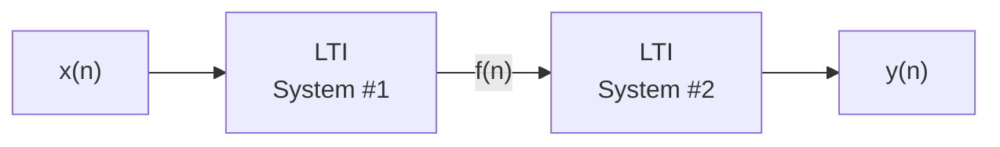
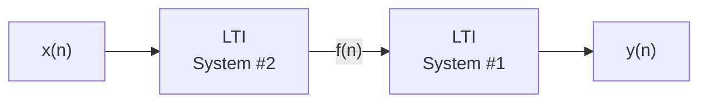

Due to this property, LTI systems sequential order can be rearranged with no change in their final output

The graph above show LTI systems in series. Swapping order of the two systems does not change the output $y(n)$